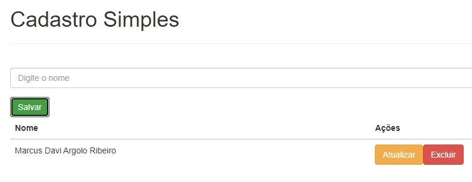

# node-mongo-composer - Cadastro Simples

## Resumo

Simples demonstração do Docker-Compose. Foi configurado para que sejam criados 3 containers para uma aplicação de um cadastro simples.

1. Container mongo:3.4 - Banco de dados
2. Container node:8.1 - Backend
3. Container ngxinx - Frontend

## Stack

- MongoDB
- NodeJs
- Html, CSS e Javascript

## Como Rodar

1. É preciso ter o Docker instalado no SO
2. Clonar o repositório
3. Rodar o comando docker-compose up

## Imagem do sistema

